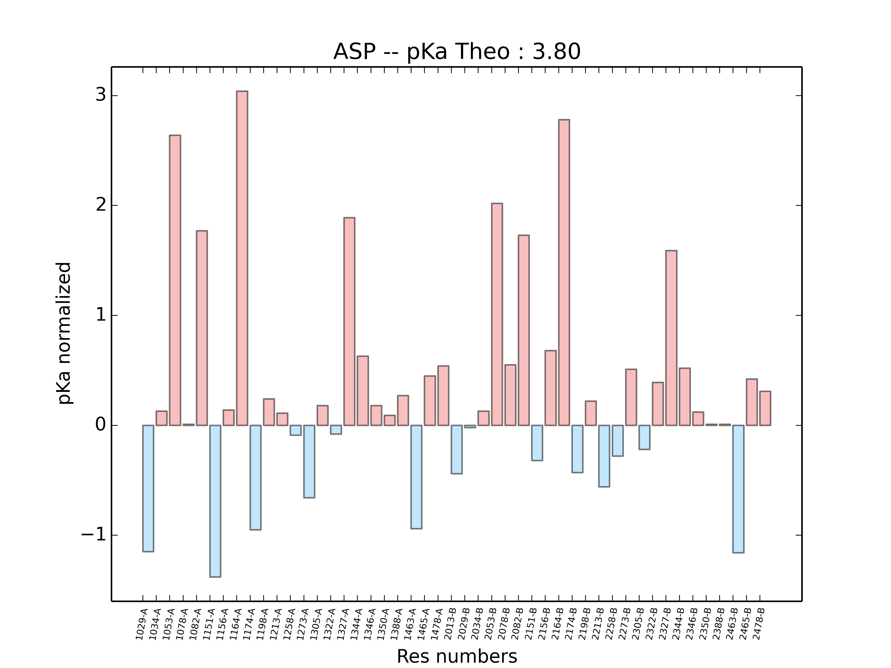
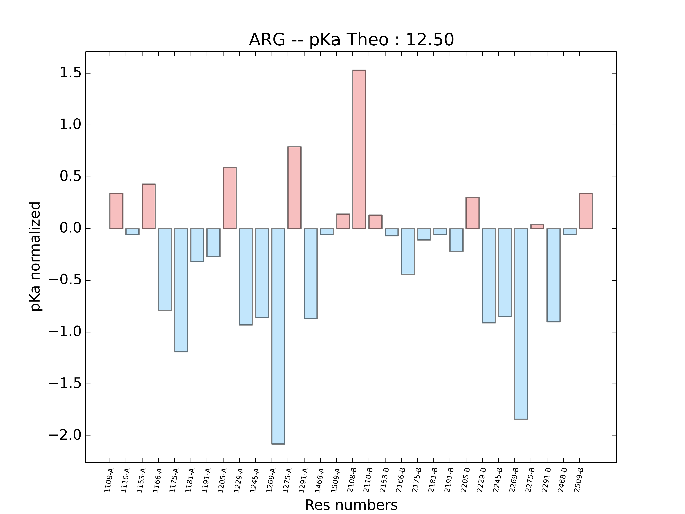

# propka2graph

This program can be used to generate graphical statistics from propka output (by residues).

```
usage: propka2graph.py [-h] -f [FILES [FILES ...]] [-c CHAINS]
                       [-p COMPARAISON] [-b BASIC]
```

Arguments : 
```
  -h, --help            show this help message and exit
  -f [FILES [FILES ...]], --files [FILES [FILES ...]]
                        propka file(s)
  -c CHAINS, --chains CHAINS
                        chain to select (separated by a coma)
  -p COMPARAISON, --comparaison COMPARAISON
                        Compare 2 propka file (Y/N)
  -b BASIC, --basic BASIC
                        basic graph? (Y/N)
```
Example : 

`python propka2graph.py -f 1ihm.pka -c A -b Y`




CAUTION:
It works only with standart amino acids.

